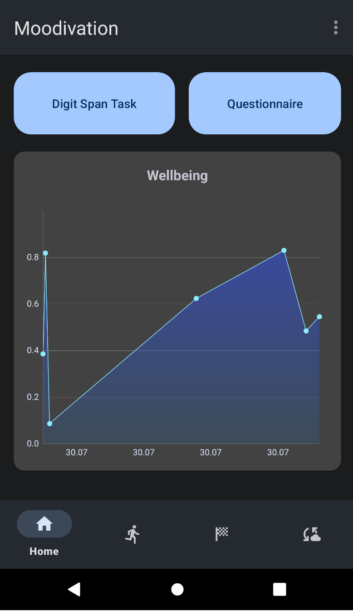

# Moodivation

A well-being app delivering digital interventions. Users provide feedback through questionnaires and participate in daily memory tests (digit span task). Progress is tracked and visualized within the app to encourage user engagement and improvement.

* [Getting Started](#getting-started)
* [Server Setup](docs/server/setup.md)
* [How to specify questionnaires?](docs/questionnaire_specification.md)
* [How to add questions to the main questionnaire?](#how-to-add-questions-to-the-main-questionnaire)
* [How to create custom interventions?](docs/intervention.md)
* [License](#license)

## Getting Started

The bottom bar contains the home page, interventions/activities, rewards, and the data page. Clicking on the three dots in the top right corner will open a menu that allows you to go to the settings, upload your data, or add a custom intervention.



Note: This screenshot contains Google Material Icons (see license below).

The implementation of the wellbeing algorithm can be found [here](Moodivation/app/src/main/java/de/b08/moodivation/questionnaire/SimpleWellbeingAlgorithm.java). If you want to add an entirely different algorithm without losing the old one, consider adding a new class that implements [`WellbeingAlgorithm.java`](Moodivation/app/src/main/java/de/b08/moodivation/questionnaire/WellbeingAlgorithm.java) and set the singleton in [`WellbeingAlgorithm.java`](Moodivation/app/src/main/java/de/b08/moodivation/questionnaire/WellbeingAlgorithm.java) accordingly.

## How to add questions to the main questionnaire?

To add questions to the main questionnaire, modify the [questionnaire files](Moodivation/app/src/main/assets/questionnaires).

## License

The following files (in the folder `Moodivation/app/src/main/res`) are Google Material Icons (https://github.com/google/material-design-icons) licensed under Apache-2.0 (http://www.apache.org/licenses/LICENSE-2.0):

```
drawable/baseline_5k_plus_24_black.xml
drawable/baseline_5k_plus_24_grey.xml
drawable/baseline_cloud_sync_24.xml
drawable/baseline_directions_bike_24_achieved.xml
drawable/baseline_directions_bike_24_grey.xml
drawable/baseline_directions_run_24.xml
drawable/baseline_directions_run_24_achieved.xml
drawable/baseline_directions_run_24_grey.xml
drawable/baseline_sports_score_24.xml
drawable/baseline_star_24_achieved.xml
drawable/baseline_star_24_grey.xml
drawable/baseline_self_improvement_24.xml
drawable/round_home_24.xml
drawable/round_settings_24.xml
```

All other code files are licensed under MIT License:

```
MIT License

Copyright (c) 2023 RUB-SE-LAB

Permission is hereby granted, free of charge, to any person obtaining a copy
of this software and associated documentation files (the "Software"), to deal
in the Software without restriction, including without limitation the rights
to use, copy, modify, merge, publish, distribute, sublicense, and/or sell
copies of the Software, and to permit persons to whom the Software is
furnished to do so, subject to the following conditions:

The above copyright notice and this permission notice shall be included in all
copies or substantial portions of the Software.

THE SOFTWARE IS PROVIDED "AS IS", WITHOUT WARRANTY OF ANY KIND, EXPRESS OR
IMPLIED, INCLUDING BUT NOT LIMITED TO THE WARRANTIES OF MERCHANTABILITY,
FITNESS FOR A PARTICULAR PURPOSE AND NONINFRINGEMENT. IN NO EVENT SHALL THE
AUTHORS OR COPYRIGHT HOLDERS BE LIABLE FOR ANY CLAIM, DAMAGES OR OTHER
LIABILITY, WHETHER IN AN ACTION OF CONTRACT, TORT OR OTHERWISE, ARISING FROM,
OUT OF OR IN CONNECTION WITH THE SOFTWARE OR THE USE OR OTHER DEALINGS IN THE
SOFTWARE.
```
